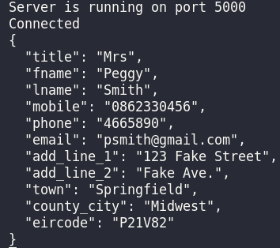
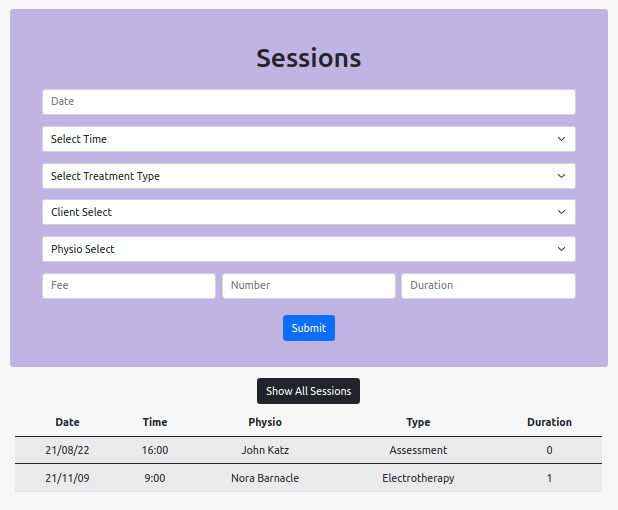
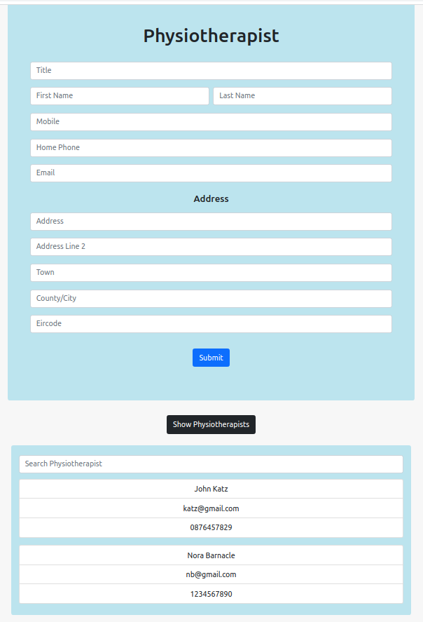
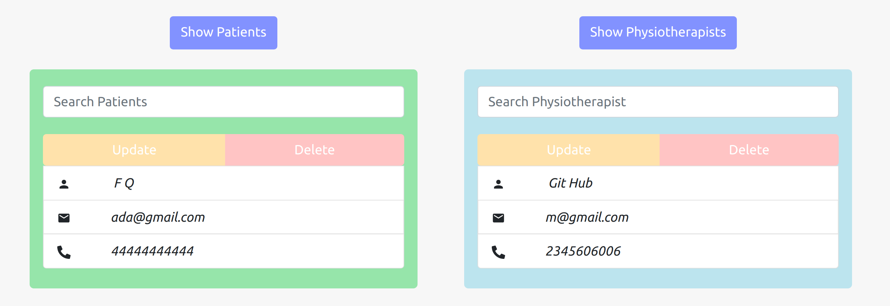
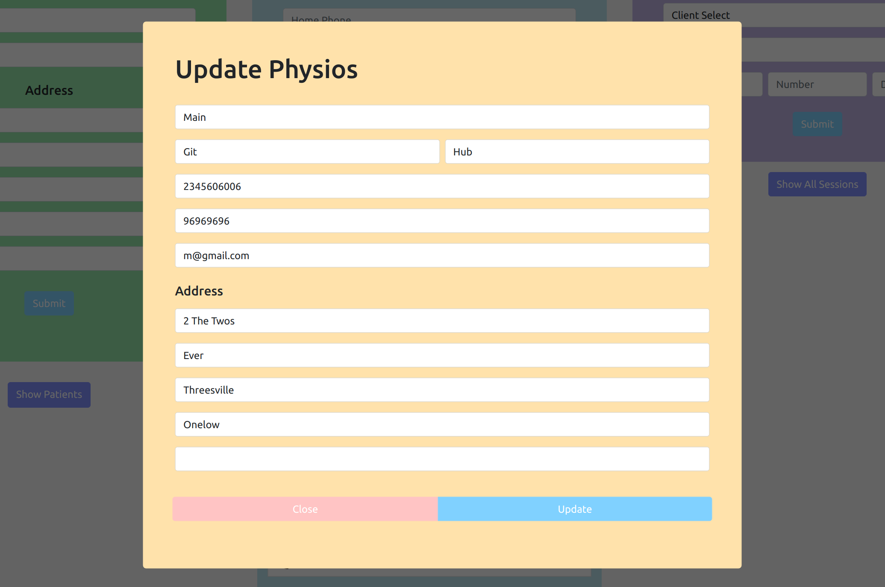
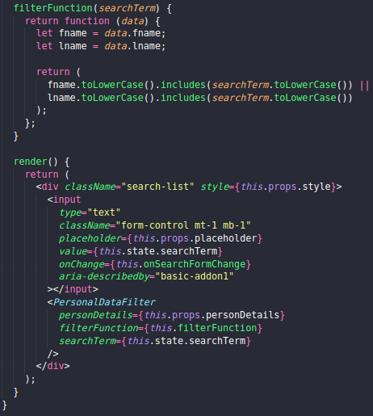
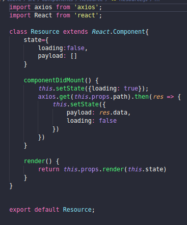
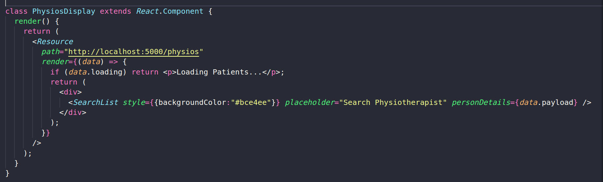

# **PHYSIOTHERAPY CLINIC CLIENT RELATIONSHIP MANAGER** 

## **Description** 
_full stack application that allows the user to manage a physio clinic's business_<br/><br/>

## **Project Goal**
To provide a MERN stack solution with a clean minimalistic SPL front-end which makes client relationship management easy<br/><br/>

## **Tech Used**<br/>


<br/><br/>

# **Features**<br/>
### *Data Model*

3 collections, somewhat normalizing the relationship between clients and physios

    -clients
        - personal details
            -embedded address
    
    -physios
        -personal details
            -embedded address

    -sessions
        -session details
        -session references id of client and physio

_This NoSql data model was chosen because the clients and physios are seperate entities that are only related through sessions
A client and a physio may have many sessions, but each session only contains 1 client and 1 physio, referenceing each of there
_id's within the session document reduces file size if the db were to grow, vs the denormalized option of embedding sessions in 
client or physio documents or embedding physio/client docs in sessions.__
<br/><br/>

### Through Node the client has full CRUD functionality of all endpoints
### Front-end also offers full CRUD functionality 
<br/>


## **Post request for client insertion**


<br/><br><br/><br/>


## **Session form and table**

<br/><br/>

## **Physio form and table**

<br/><br/>

## **Data retrievel with list icons and update/delete buttons**

<br/><br/>

## **Update modal**

<br/><br/>

### **All result tables of the front end are searchable through text input box and provide live updates on the list with update and delete functionality**<br /><br />


# **To Run This Project**

```
$ git clone https://github.com/jphoulihan/crm-physio-clinic.git
```
<br/>

_For both app directory and client directory_

```
$ npm i
```

_Run in app directory_
```
$ node app.js
```

_Run in client directory_
```
$ npm start
```

<br/><br/>

# **Learning Outcomes**
### NoSQL Document Model
### Complete CRUD operations on Node server with Express and Mongoose
### Form control with back and front-end required fields
### Filter lists in React components <br/><br />
<br/><br/>
### Render props technique (a simple technique for sharing code between React components) to compartmentalize requests for a flexible reusable component<br/><br/>
<br/><br/>
### Render props in use<br />
<br/><br/>


<br/><br/>

# **Future Development**

### ~~Add Patch and Delete Functionality to the front-end~~ <em>Task Complete</em>
### Create a more appealing way to add time and date to the Session creation
### Deploy Application to the web 
<br /><br />

### **Created by**

- [John Houlihan](https://github.com/jphoulihan "Visit John's GitHub")<br/><br/>

### **License**

[](https://opensource.org/licenses/MIT)